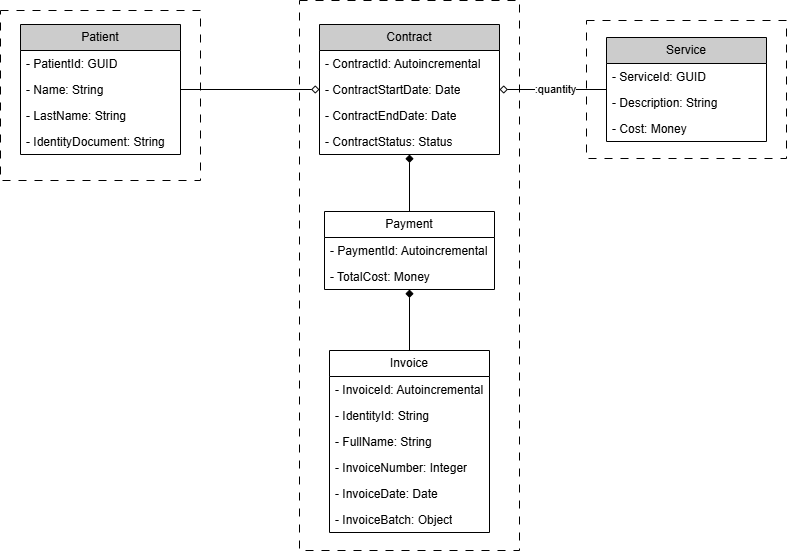
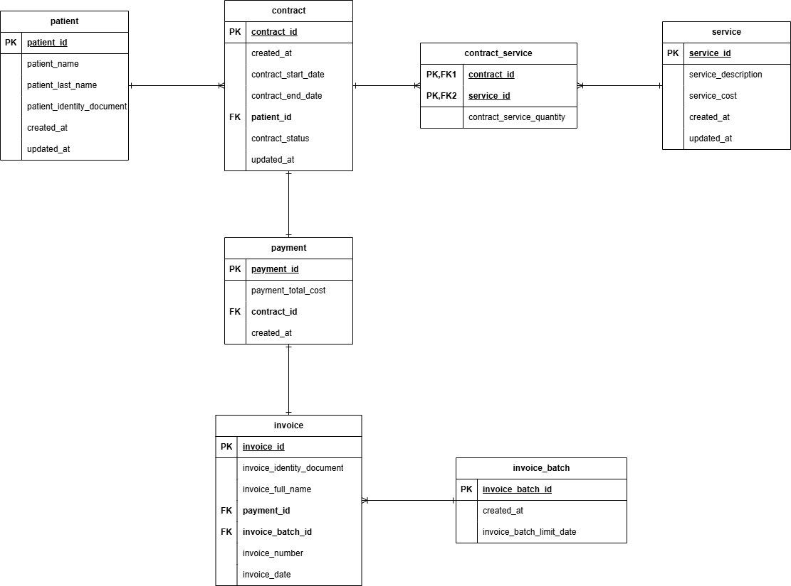

# CONTRACT SERVICE - MICROSERVICE

## Goal ##

Register and allow the payment of a Service contracted by a Patient

## Functionalities

* Generating a contract - allows to register a contract and its service that a patient has used
* Cancelling a contract - allows to cancel a contract previously registered
* Paying a contract - allows to pay a contract and to generate its invoice

### Domain

Three aggregates were defined and organized into packages.

* **Contract** - includes 3 entities Contract, Payment, and Invoice.
* **Patient** - includes only 1 entity Patient.
* **Service** - includes only 1 entity Service.

Three Value Objects were identified.

* **Money** - which controls and validates details of currency for Unit Cost, Total Cost, Price, etc.
* **Quantity** - which controls and validates details of quantity of services.
* **Status** - which controls values of contract status (Generated, Cancelled, Paid).

### Database

From a mapping of the Classes Diagram and inserting necessary fields and tables, the schema of the database used for this microservice is following:

Database repository: https://github.com/fernandomn1983/database-contract-services

### Technology

* Spring Boot 3
* Java 25
* Postgres 14
* Liquibase
